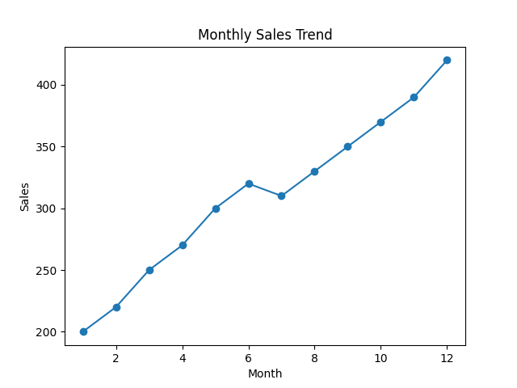
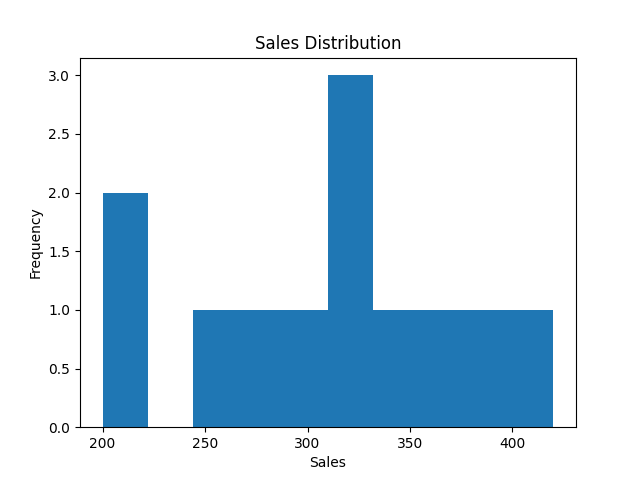
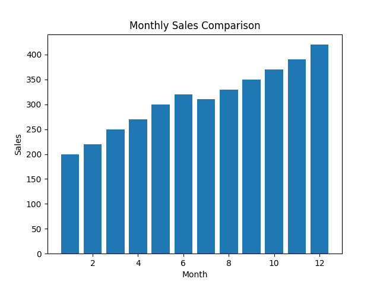
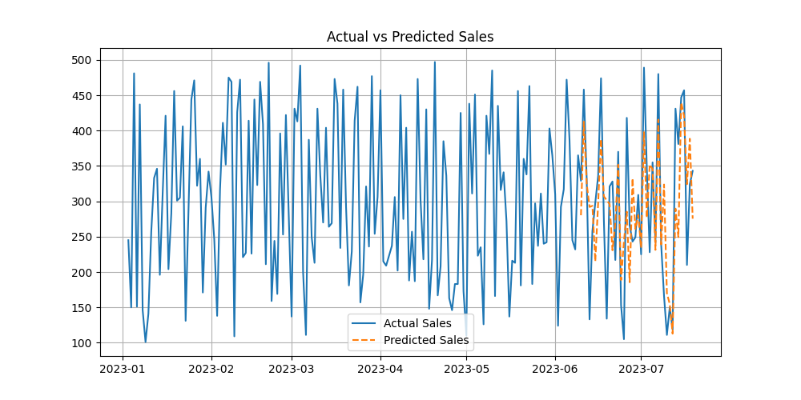
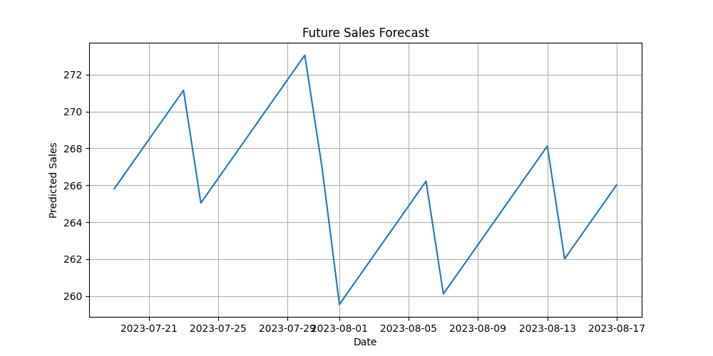

#  Sales & Demand Forecasting for Businesses

This project focuses on predicting future sales using historical data with the help of Machine Learning techniques. It helps businesses make better decisions in inventory management, planning, and growth strategies.

---

##  Project Overview

Accurate sales forecasting is essential for businesses to:
- Manage inventory efficiently  
- Plan production  
- Improve decision-making  

This project builds a forecasting model using historical sales data and predicts future demand.

---

##  Objectives

- Analyze historical sales data  
- Perform data preprocessing and feature engineering  
- Build a Machine Learning model for forecasting  
- Visualize trends and predictions  
- Generate business insights  

---

##  Tools & Technologies Used

- Python  
- Pandas  
- NumPy  
- Matplotlib  
- Scikit-learn  

---

##  Features of the Project

- Data cleaning and preprocessing  
- Time-based feature engineering  
- Sales forecasting using Linear Regression  
- Model evaluation using Mean Absolute Error (MAE)  
- Multiple visualizations for better understanding  

---

##  Visualizations

The project includes the following graphs:

1. **Actual vs Predicted Sales**  
2. **Sales Trend Over Time**  
3. **Monthly Sales Analysis**  
4. **Sales Distribution**  
5. **Future Sales Forecast**

---

## 📊 Project Visualizations

### 1️⃣ Sales Trend Over Time

### 2️⃣ Sales Distribution (Histogram)

### 3️⃣ Monthly Sales Analysis (Bar Chart)

### 4️⃣ Actual vs Predicted Sales

### 5️⃣ Future Sales Forecast

## Author
Paluri Uma Naga Srinivas
